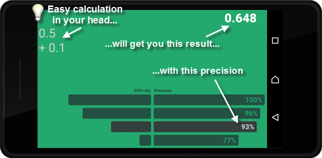

# Mentol
### Calculate exchange rates easily in your head

Ever been to a foreign country and struggled to have some prices converted back to your own currency? Yes, you have a great calculator app on your smartphone - maybe it can even scan the pricetag for you and show the converted price immediately. But is it convenient to pull out your smartphone 100 times in a crowded market? Are you OK with taking your smartphone to the beach, right next to a splashing party?

### This mobile app reveals neat tricks to quickly convert USD to EUR, or EUR to HUF, or...

Suppose that the exchange rate from USD to EUR is 0.648 which means a **$50 price tag** shall mean €32.40 to you. Now you're a human, not a computer, so how do you manage to calculate this in your head without going insane? Looks pretty tough...
Well, the Mentol app will tell you to take one half of the USD price tag (easy to guess: 25), then take one tenth of that same price tag (easy too: 5), then sum those two numbers up. Easy again: 25+5 = 30 EUR.

### Congrats! You've just multiplied by 0.648 with a precision of 93% !
